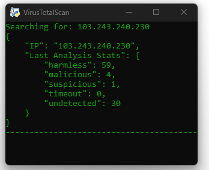
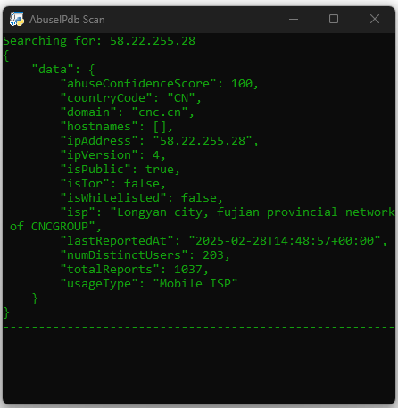

# My Scripts Repository

Welcome to my **My Scripts Repository**! This repository contains a collection of my scripts, ranging from cybersecurity tools to file monitoring utilities.

## Overview
This repository serves as a hub for my personal scripts, tools, and utilities. These scripts are designed for automation, security research, and system monitoring. Below is a breakdown of the projects available in this repository.

## Requirements
- Ensure you have Python installed (Python 3 recommended). 
- Use legacy command prompt for always-stay-ontop feature of the IP scanners
- Install dependencies using:
```bash
pip install requests pyperclip ctypes pywin32 ipaddress win10toast watchdog logging
```
## 🔎Security & Log Analysis Tools

### 1. **VirusTotal Clipboard IP Scanner** (`VTClipboardIP.py`)
A script that monitors the clipboard for IP addresses and checks them against **VirusTotal’s database**.

- Automatically scans copied IP addresses                                                                        
- Displays results in a structured format
- Uses VirusTotal API for threat analysis
- 📌Designed to stay on top of other windows, allowing for seamless monitoring without disrupting your workflow

**Usage:**
```bash
python VTClipboardIP.py
```

---

### 2. **VirusTotal File Scanner** (`ScanFile.py`)
A script that scans files using the **VirusTotal API v3**.

- Checks if files have been scanned before using SHA-256 hashes
- Uploads new files for scanning if no previous results are found
- Displays scan results with links to VirusTotal reports

**Usage:**
```bash
python ScanFile.py
```

---

### 3. **AbuseIPDB Checker** (`abuseipdbTool.py`)
A script that checks if an IP address has been reported for abuse in the last 90 days using the **AbuseIPDB API**.

- Scans clipboard for IPs and checks for abuse reports
- Uses API authentication for secure queries
- Logs results in the console
- 📌Designed to remain on top of other windows, ensuring quick access and continuous visibility while working

**Usage:**
```bash
python abuseipdbTool.py
```

---

### 4. **Security Log Parser** (`logParser.py`)
A tool that scans log files for security-related events and extracts critical alerts.

- Filters logs for critical security events
- Saves extracted alerts to a separate file for further investigation
- Helps in identifying security incidents

**Usage:**
```bash
python logParser.py
```

---

### 5. **Security Log Alert System** (`logAlert.py`)
This script analyses log files and sends real-time alerts when critical or suspicious events are detected.

- Desktop notifications for critical security logs
- Saves alerts in `alerts.log` for review
- Helps in proactive monitoring of security events

**Usage:**
```bash
python logAlert.py
```

## 👀System Monitoring Tools

### 6. **File System Monitor** (`monitor_directory.py`)
A script that monitors changes (creation, modification, deletion) in a specified directory using the `watchdog` Python module.

- Logs file system events in `monitor.log`
- Detects file modifications, creations, and deletions
- Uses Python's `watchdog` library

**Usage:**
```bash
python monitor_directory.py
```


